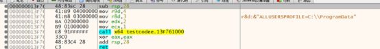
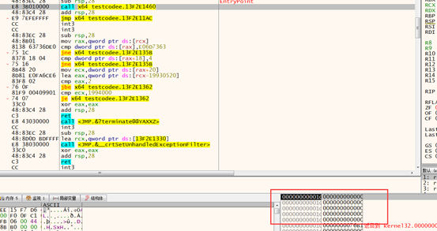
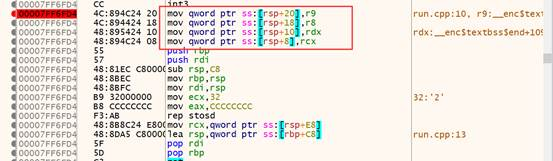

---
layout: post
title: 函数调用过程
date: 2021-07-16 09:30
tags: 逆向
excerpt: "本文介绍 函数调用过程以及一些基础的二进制逆向知识。"
toc: true
---	
## 1.函数调用过程栈变化

### 1.1 x86调用约定与函数传参

### 1.2 x64调用约定与函数传参

1. 传参方式

在X64下，是寄存器传参，前4个参数分别为RCX、RDX、R8、R9其余参数通过栈传参，从右向左入栈。

2. 申请参数预留空间

在x64下，在调用一个函数时，会申请一个参数的预留空间，在x64中一样会申请栈空间，只不过这个地方在进函数的时候并没有值，进入函数之后才会将寄存器的值拷贝到这个栈中（相当于外边申请了空间，在内部进行赋值）
我们编写一个简单的x64程序.对其反汇编进行查看.

首先开辟我们的参数空间,以及返回地址空间.我们单步一下查看

可以看大开辟了 5\*8个字节大小的空间.

然后下方的汇编对其寄存器赋值.进行传参.说明我们只有4个参数.

此时进入Call内部.看下栈.

3.栈按照16字节对齐

在调用一个函数时，使用sub rsp,XXX 进行抬栈，函数内部进行参数赋值。

0x20(4个参数的空间)+0x8(对齐空间)+0x8(返回值的空间) = 0x30对齐了

## 2.逆向知识

### 2.1寻找main入口点

OD打开需要查看的程序，可以看到调用API的位置，VC中的main函数是3个参数，只需要找到三个push然后一个call的位置则可以确定（按F7跟进去，看看代码是不是main函数，或者参数传参是什么。）

Debug版本可以看到直接看到函数传参的参数。

使用IDA打开，先看入口点特征，Debug版本特征是调用API GetVersion

找main的基本步骤：1.找到调用GetVersion函数的位置

                   2.找到三个push一个call

                   3.F7跟入查看。

VC系列：MainCRTStartup ->GetVersion->main

VS系列： wmainCRTStartup->tmainCRTStartup

### 2.2逆向中的优化方式，以及加减乘

1.汇编代码的混淆优化和优化区别：

优化：指的是汇编代码越少越好，让程序更快的执行

混淆：一条汇编代码变为多条汇编代码，影响逆向人员的破解能力，但是软件效率大大降低。

2.加减乘的常见的几种优化方式：

优化方式：常量优化、常量传播、变量去除、窥孔优化。

PS：优化只有在release版本下才会进行优化，Debug版本也会优化，但是在不影响调试的情况下进行优化。

常量叠加：值得是在编译之前遇到的常量，都可以进行计算的，得出一个新的常量值，这样就可以直接变为一个常量push。

常量传播：变量在写入或者读取的时间内，没有对它进行修改或者传地址以及重新写入的动作，那么在引用这个变量的时候，可以当作常量替换。

乘法的优化分为带幂优化和不带幂优化：

带幂优化：是在算乘法的时候，可以左移几位。

不带幂优化：直接指令相乘。

3.除法的优化：

在计算机中出发运算对应的的汇编指令分为DIV（无符号除法指令）以及IDIV（有符号除法指令）

计算机中的除法：
1. 有符号和无符号进行混除，结果是无符号的。

2. 两个无符号整数相除，结果还是无符号。

3. 计算机中面临小数分为向下取整和向上取整。

         向下取整：取得不大于该数的最大整数，小于该数遇到的第一个整数。

         向上取整：不小于x的最大整数。
