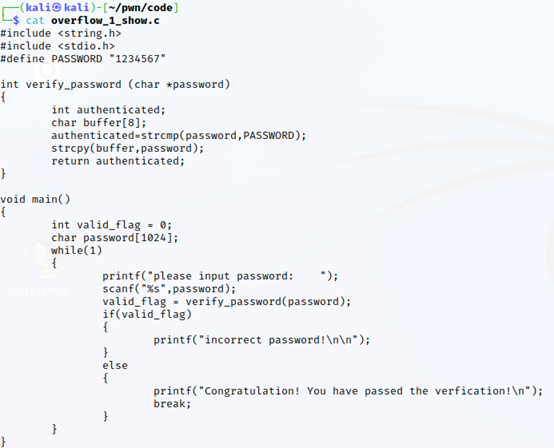
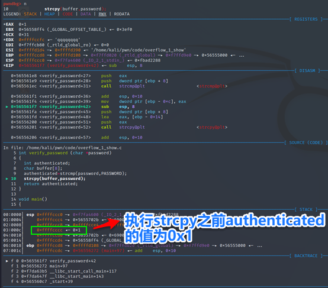
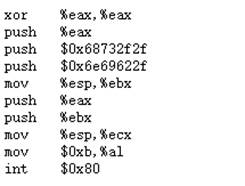
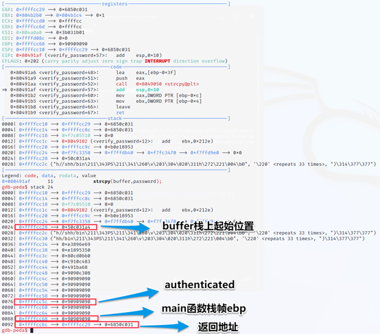

---
layout: post
title: 栈溢出漏洞的实验分析
date: 2021-07-18 09:30
tags: 二进制安全
excerpt: "本文介绍二进制安全漏洞-栈溢出漏洞的实验。"
toc: true
---	

#### 栈溢出漏洞

##### 栈的工作原理

###### 函数调用过程

当cpu在执行调用func\_A函数时，会从代码区中main函数对应的机器指令的区域跳转到func\_A函数对应的机器指令区域，在那里取值执行：当func\_A函数执行完毕，需要返回的时候，又会跳回到main函数对应的指令区域。

1.CPU是怎么知道要去func\_A代码区取值，在执行完func\_A后又是怎么跳回main函数的？

代码区精确的跳转都是在与栈巧妙地配合中完成地。当函数被调用时，栈会为这个函数开辟一个新地栈帧，并把它压入栈中。这个栈帧中的内存空间会被他所属函数独占，正常情况下不会和别的函数共享。当函数返回时，系统栈会弹出该函数所对应地栈帧。


从上图可以看出，在main函数调用func\_A的时候，首先在自己的栈帧中压入func\_A的参数以及函数返回地址，然后为func\_A创建新栈帧并压入系统栈。

函数栈帧： ESP和EBP之间的内存空间为当前栈帧，EBP标识了当前栈帧的底部，ESP标识了当前栈帧的顶部。

在函数栈帧中，一般包含以下几类重要信息：

（1）     局部变量：为函数局部变量开辟的内存空间。

（2）     栈帧状态值： 实际只保存前栈帧的底部，前栈帧的顶部可以通过堆栈平衡计算得到。

（3）     函数返回地址：保存当前函数调用前的“断点”信息，也就是函数调用前的指令位置以便在函数返回时能够恢复到函数被调用前的代码区中继续执行指令。

EIP:指令寄存器，其内存放着一个指针，该指针永远指向下一条等待执行的指令地址。

**如果控制了EIP寄存器的内容，就控制了进程。**

###### 函数调用的步骤

（1）参数入栈：将参数从右到左依次压入系统栈中。

（2）返回地址入栈：将当前代码区调用指令的下一条指令地址压入栈中，供函数返回时继续执行。

（3）代码区跳转：处理器从当前代码区跳转到被调用函数的入口。

（4）栈帧跳转：具体包括

保存当前栈帧状态值，已备后面恢复本栈帧时使用（EBP入栈）；

将当前栈帧切换到新栈帧（将esp值装入ebp，更新栈帧底部）；

给新栈帧分配空间（把ESP减去所需空间的大小，抬高栈顶）；

###### 函数返回的步骤

（1）保存返回值：通常将函数的返回值保存在寄存器EAX中。

（2）弹出当前栈帧，恢复上一个栈帧

具体包括：

a.在堆栈平衡的基础上，给ESP加上栈帧的大小，降低栈顶，回收当前栈帧的空间。

b.将当前栈帧底部保存的前栈帧EBP值弹入EBP寄存器，恢复出上一个栈帧。

c.将函数返回地址弹给EIP寄存器。

（3）跳转：按照函数返回地址跳回母函数中继续执行。


##### 修改邻接变量

大多数情况下函数的局部变量在栈中是一个挨着一个排列的（这里出于介绍基本原理目的，忽略编译优化等情况造成的例外）。如果这些局部变量中有数组之类的缓冲区，并且程序中存在数组越界的缺陷，那么越界的数组元素就有可能破坏栈中相邻变量的值，甚至破坏栈帧中所保存的EBP值、返回地址等重要数据


实验过程中关闭了地址随机化

sudo sysctl -w kernel.randomize\_va\_space=0


注：\-m 32编译为32位

\-fno-stack-protector 关闭栈保护

\-no-pie

\-z execstack

\-g debug版本

###### 源码&原理分析



外部输入的password，通过verify\_passwd函数

1.判断字符串是否一致

2.进行一个strcpy的操作使其有机会覆盖栈上的内容。（此处是为了了解栈溢出而人为构造的有漏洞的代码。）

修改邻接变量成功界面：


###### 调试过程




经过上述分析和动态调试，我们知道即使不知道正确的密码“1234567”，只要输入一个8个字符的字符串（大于1234567当authenticated为0x1），那么字符串中隐藏的第9个截断字符NULL就应该能够将authenticated低字节中的1覆盖成0，从而绕过验证程序！

##### 代码植入

上述实验介绍的修改邻接变量的方法很有用，但是这种漏洞利用对环境的要求相对比较苛刻。更通用、更强大的攻击通过缓冲区溢出改写的目标往往不是某一个变量，而是瞄准栈帧最下方的EBP和函数返回地址等栈帧状态值。

###### 源码&原理分析


Shellcode说明：

Linux/x86 execve /bin/sh shellcode 23 bytes

```
\\x31\\xc0\\x50\\x68\\x2f\\x2f\\x73\\x68\\x68\\x2f\\x62\\x69 \\x6e\\x89\\xe3\\x50\\x53\\x89\\xe1\\xb0\\x0b\\xcd\\x80+90…+返回地址（shellcode的起始地址）
```




参考链接：https://shell-storm.org/shellcode/files/shellcode-827.php

原理：

溢出后的数据从buffer位置开始覆盖，包括authenticated以及函数返回地址都被覆盖成我们的一串可执行机器码。将返回地址覆盖为机器码的起始位置。


###### 调试过程

进入verify\_password函数先push ebp(保存旧栈帧(main函数)ebp --> 0xffffd0a8)此时栈顶位置： esp -->0xffffcc68


push ebx


调用之前堆栈内容，其中0xffffcc5c是变量authenticated

                                     0xffffcc68是main函数栈帧ebp

                                     0xffffcc6c是verify\_password返回地址


调用之后堆栈内容，将变量&ebp&返回地址覆盖

使得返回地址指向buffer的位置（shellcode的起始位置）

继续执行到verify\_password返回调用，此时栈顶位置存放的就是0xffffcc29（我们构造的返回地址，shellcode的起始地址）



继续执行可以看到栈顶位置存放的是替换过的返回地址


此时eip指向了shellcode的地址


继续执行改变原有流程获取到shell 执行ls


