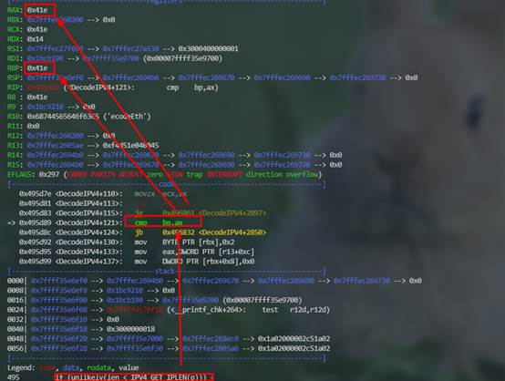

---
layout: post
title: GDB调试-suricata源码
date: 2022-01-22 09:30
tags: 逆向
excerpt: "本文介绍 GDB调试-suricata源码记录。"
toc: true
---	

## GDB调试-suricata源码

### 1.   静态分析

函数调用关系是：DecodeEthernet->DecodeIPV4->DecodeIPV4Packet

### 2.动态调试

1.将断点下在DecodeEthernet函数处

2.继续运行，断在该函数处

2.     单步执行调用了DecodeIPV4()函数

3.步入DecodeIPV4函数

4.单步执行调用了DecodeIPV4Packet函数

5.步入DecodeIPV4Packet函数

7.     包大小小于1500时

此时的len = 获取到的包长度，不会给包进行一个截断包的标识

8.     继续运行，可以看到包大小小于1500时，获取len是等于包大小的。当包大小为1514时获取到的包大小是1500.

9.     继续执行前面的调用过程

10.    此时RAX寄存器中的内容大于RBP寄存器中的内容，满足判断条件为真，为该pcap包打上截断包的标志。

